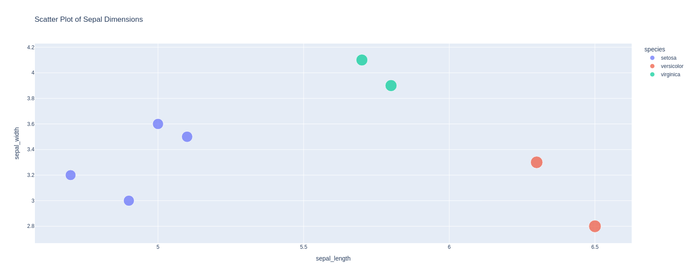

Plotly Express is a high-level interface for creating visualizations in Python, designed to make it easy to create interactive and aesthetically pleasing plots with minimal code. It’s part of the Plotly library and provides functions for generating common plot types, which can be customized further.

### Key Features of Plotly Express
- **Quick plotting**: Generate interactive plots with just a few lines of code.
- **Wide range of plot types**: Scatter plots, line plots, bar charts, histograms, box plots, choropleths, and more.
- **Dataframe-based**: Works well with pandas dataframes, making it easy to create visualizations directly from your data.
- **Customizable**: Options to change colors, size, hover data, facet grouping, and more.
- **Built-in interactivity**: Zooming, panning, and tooltips by default.

### Basic Usage

Here’s a quick example of how to create a scatter plot using Plotly Express:

### Common Plotly Express Functions
- **`px.scatter`**: For scatter plots.
    ### show Scatter plot :
    

- **`px.line`**: For line plots.
- **`px.bar`**: For bar charts.
- **`px.histogram`**: For histograms.
- **`px.box`**: For box plots.
- **`px.pie`**: For pie charts.
- **`px.choropleth`**: For geographic choropleth maps.

Each function has similar syntax, so once you learn one, others become intuitive to use.

